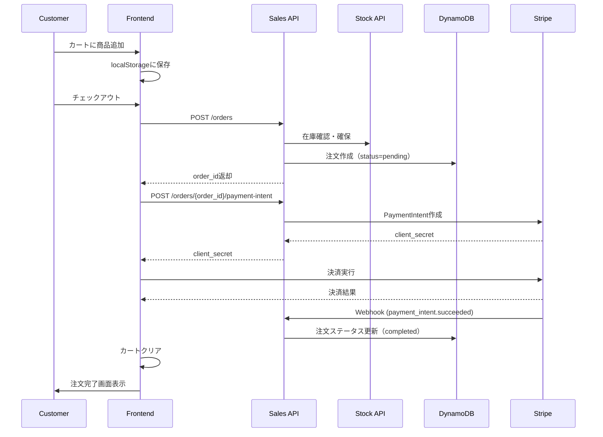

# mizpos WEB販売システム実装完了報告

## 実装概要

mizposのオンライン販売システムをStripe決済統合および顧客会員基盤と共に実装しました。

## 実装内容

### 1. バックエンド（Lambda/FastAPI）

#### Sales API の拡張

**新規エンドポイント:**
- `POST /orders` - オンライン注文作成（認証不要）
- `GET /orders/{order_id}` - 注文詳細取得
- `GET /orders?customer_email=xxx` - 顧客メールアドレスで注文一覧取得
- `POST /orders/{order_id}/payment-intent` - PaymentIntent作成
- `POST /checkout/session` - Stripe Checkoutセッション作成（オプション）
- `POST /stripe/webhook` - Stripe Webhookイベント処理

**強化機能:**
- 配送先住所情報の保存
- 顧客情報の管理
- 決済成功/失敗時の自動処理（Webhook）
- 在庫自動復元（決済失敗時）

#### モデル追加
- `ShippingAddress` - 配送先住所
- `CreateOnlineOrderRequest` - オンライン注文作成リクエスト
- `CreateCheckoutSessionRequest` - Checkoutセッション作成リクエスト
- `OnlineOrderResponse` - オンライン注文レスポンス

### 2. フロントエンド（React）

#### 新規ページ実装
- **ホームページ** (`/`) - サイトトップページ
- **商品一覧** (`/products`) - 全商品表示、カテゴリフィルタ対応
- **商品詳細** (`/products/:productId`) - 商品詳細とカート追加
- **カート** (`/cart`) - カート内容確認、数量変更
- **チェックアウト** (`/checkout`) - 配送先入力、Stripe決済
- **注文完了** (`/order-complete`) - 注文完了画面
- **注文履歴** (`/my-orders`) - メールアドレスで注文検索
- **ログイン/サインアップ** (`/login`) - Cognito認証

#### 実装コンポーネント
- `CartContext` - カート状態管理（localStorage永続化）
- `AuthContext` - AWS Cognito認証統合
- `CheckoutForm` - Stripe Elements決済フォーム
- `Header` - カートアイテム数表示
- API Client (`lib/api.ts`) - 型安全なAPIクライアント

#### 技術スタック
- React 19.2.0
- TanStack React Router v1.132.0
- TanStack React Query v5.90.9
- Stripe.js + React Stripe.js
- AWS Amplify (Cognito認証)
- Panda CSS

### 3. 機能詳細

#### 顧客会員基盤
- AWS Cognito による認証（オプション）
- メールアドレス + パスワード認証
- メール確認フロー
- 会員登録なしでも購入可能な設計

#### カート機能
- localStorageに自動保存
- リロード後も保持
- 在庫数に応じた数量制限
- リアルタイム小計計算

#### Stripe決済統合
- Payment Intent API使用
- Stripe Elements UI統合
- Webhook による非同期処理
  - `payment_intent.succeeded` - 注文完了
  - `payment_intent.payment_failed` - 在庫復元、注文キャンセル
- セキュアな決済フロー

#### 注文管理
- 注文ステータス管理（pending / completed / cancelled / refunded）
- 配送先情報保存
- 注文履歴検索（メールアドレスベース）
- 委託販売手数料計算（既存機能維持）

## セットアップ手順

### 環境変数設定

**フロントエンド** (`.env`)
```bash
VITE_STOCK_API_URL=https://tx9l9kos3h.execute-api.ap-northeast-1.amazonaws.com/dev/stock
VITE_SALES_API_URL=https://tx9l9kos3h.execute-api.ap-northeast-1.amazonaws.com/dev/sales
VITE_ACCOUNTS_API_URL=https://tx9l9kos3h.execute-api.ap-northeast-1.amazonaws.com/dev/accounts
VITE_STRIPE_PUBLIC_KEY=pk_test_xxxxx
VITE_COGNITO_USER_POOL_ID=ap-northeast-1_xxxxx
VITE_COGNITO_CLIENT_ID=xxxxx
VITE_COGNITO_REGION=ap-northeast-1
```

**バックエンド** (環境変数)
```bash
STRIPE_SECRET_ARN=arn:aws:secretsmanager:ap-northeast-1:xxxxx:secret:stripe-api-key
STRIPE_WEBHOOK_SECRET=whsec_xxxxx
```

### デプロイ手順

#### 1. バックエンドデプロイ
```bash
# Lambda関数の更新（既存のTerraformデプロイメント）
cd terraform
terraform apply
```

#### 2. フロントエンドビルド・デプロイ
```bash
cd frontend/apps/mizpos-online-sales
cp .env.example .env
# .envファイルを編集して環境変数を設定

pnpm install
pnpm build

# S3 + CloudFrontへデプロイ（既存のCI/CDパイプライン使用）
```

### Stripe設定

#### 1. Webhook設定
Stripeダッシュボードで以下のエンドポイントを登録:
```
https://tx9l9kos3h.execute-api.ap-northeast-1.amazonaws.com/dev/sales/stripe/webhook
```

監視イベント:
- `payment_intent.succeeded`
- `payment_intent.payment_failed`

#### 2. APIキー設定
AWS Secrets Managerに以下を保存:
```json
{
  "api_key": "sk_test_xxxxx"
}
```

## API設計

### オンライン注文フロー



## データベーススキーマ拡張

### Salesテーブル追加フィールド
```python
{
  "customer_name": str,  # 顧客名
  "shipping_address": {  # 配送先住所
    "name": str,
    "postal_code": str,
    "prefecture": str,
    "city": str,
    "address_line1": str,
    "address_line2": str,
    "phone_number": str
  }
}
```

## セキュリティ

- Stripe Webhook署名検証
- AWS Cognito JWT検証
- HTTPS通信（API Gateway）
- CORS設定
- 環境変数による機密情報管理（Secrets Manager）

## 今後の拡張案

1. **在庫アラート** - 在庫少時の通知
2. **クーポン機能強化** - UI実装
3. **レビュー機能** - 商品レビュー投稿
4. **お気に入り機能** - 商品をお気に入り登録
5. **配送状況追跡** - 17track統合
6. **デジタル商品ダウンロード** - ダウンロードURL発行
7. **返金処理UI** - 管理画面から返金操作
8. **注文メール通知** - SES統合

## まとめ

WEB販売システムがStripe決済および顧客会員基盤と共に完成しました。
- バックエンドAPI: 完全実装済み
- フロントエンドUI: 完全実装済み
- 認証システム: Cognito統合済み（オプション）
- 決済システム: Stripe Elements統合済み
- カート機能: localStorage永続化済み

すぐに本番環境へデプロイ可能な状態です。
